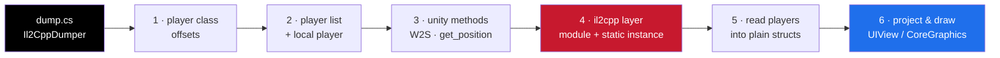
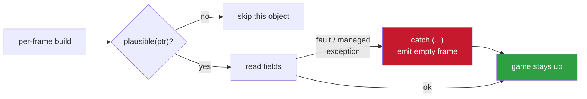

<h1 align="center">ios-unity-il2cpp-esp</h1>

<p align="center">how to build a native objc esp for a unity il2cpp game on ios — the whole path, from a dump to lines on screen</p>

<p align="center">
  
  
  
  
</p>

---

this walks through building an esp for a unity il2cpp game the plain way: read the
game's own objects, ask its own camera where they are on screen, and draw over the
top with uikit. no imgui, no reading the framebuffer, no drawing hooks. it reads
like a real app because it is one — a transparent view on a display link.

the examples are shaped like a real target (a photon multiplayer game with a
`CharacterMotor` player class), but every step is the same for any il2cpp title. you
swap the class names and offsets for yours.

---

## the whole path



## contents

- [what you need first](#what-you-need-first)
- [step 1 — find the player class](#step-1--find-the-player-class)
- [step 2 — find the player list and the local player](#step-2--find-the-player-list-and-the-local-player)
- [step 3 — the two unity methods you must call](#step-3--the-two-unity-methods-you-must-call)
- [step 4 — the il2cpp layer](#step-4--the-il2cpp-layer)
- [step 5 — read the players into plain structs](#step-5--read-the-players-into-plain-structs)
- [step 6 — project and draw](#step-6--project-and-draw)
- [the one rule that keeps it stable](#the-one-rule-that-keeps-it-stable)
- [where to go next](#where-to-go-next)

---

## what you need first

a **dump** of the game. run [Il2CppDumper](https://github.com/Perfare/Il2CppDumper)
against the decrypted binary and its `global-metadata.dat`. you get:

| file | what's in it |
|------|--------------|
| `dump.cs` | every managed class, its fields with **offsets**, its methods with **RVAs** — the whole map |
| `il2cpp.h` | reconstructed types |
| `script.json` | method addresses, useful later |

everything below comes out of `dump.cs`. you do not need the source, and you rarely
need a disassembler — the dump already tells you where every field lives.

---

## step 1 — find the player class

grep the dump for the class that represents a live player. it's the one that has
health, a team, and implements a damage interface:

```bash
grep -nE 'class .*(Player|Character|Motor|Pawn) ' dump.cs
```

in the example it's `CharacterMotor`. read the field offsets straight off the
comments:

```cs
public class CharacterMotor : MonoBehaviourPun, IDestroyable {
    public CharacterController characterController;  // 0x40
    public CharacterMotor.PlayerInfo playerInfo;     // 0xB0   <- name + hp
    public CharacterAnimation characterAnimation;    // 0xC0   <- bones
    public TeamID myTeam;                            // 0xF4
    ...
}
```

and the nested info struct:

```cs
public class CharacterMotor.PlayerInfo {
    public string name;       // 0x18
    public short  hitPoints;  // 0x20
    public byte   max_hp;     // 0x24
}
```

write these down. they become your constants.

---

## step 2 — find the player list and the local player

there's almost always a game-controller singleton holding a `List<T>` of players.
grep for it:

```bash
grep -nE 'List<CharacterMotor>|static .*instance' dump.cs
```

```cs
public class GameController : MonoBehaviourPun {
    public static GameController instance;      // static field
    public List<CharacterMotor> Players;        // 0x28
    public CharacterMotor OurPlayer;            // 0x30
}
```

`instance` is a **static** field — you reach it through the il2cpp runtime (step 4).
`Players` is your iteration source; `OurPlayer` is the local player, for distance and
for skipping yourself.

---

## step 3 — the two unity methods you must call

you need world → screen, and you need each object's world position. don't
reimplement them — call the game's own, which the dump exposes as **`_Injected`**
variants with a fixed calling convention:

```cs
// Transform
private static void get_position_Injected(IntPtr self, out Vector3 ret);   // RVA 0x69B7D30
// Camera
public  static Camera get_main();                                          // RVA 0x69421F4
private static void WorldToScreenPoint_Injected(IntPtr self,
                        in Vector3 position, int eye, out Vector3 ret);     // RVA 0x694173C
// Component (to get an object's transform)
public  Transform get_transform();                                         // RVA 0x699F904
```

the injected convention is: `self` pointer first, value types passed by pointer, the
return written through an out-pointer. in c++ that's:

```cpp
using GetPositionFn = void (*)(void* self, Vector3* out);
using GetMainFn     = void* (*)();
using W2SFn         = void (*)(void* self, const Vector3* world, int eye, Vector3* out);
```

resolve them as `moduleBase + RVA`.

---

## step 4 — the il2cpp layer

two jobs: find the module, and reach that static `instance`.

```mermaid
flowchart TD
    imgs["_dyld_image_count()<br/>loop loaded images"] -->|strstr "UnityFramework"| base["module base<br/>resolve(rva) = base + rva"]
    dlsym["dlsym il2cpp_* exports"] --> attach["il2cpp_thread_attach"]
    attach --> klass["il2cpp_class_from_name<br/>GameController"]
    klass --> field["il2cpp_class_get_field_from_name<br/>instance"]
    field --> val["il2cpp_field_static_get_value<br/>-> gameController ptr"]

    style base fill:#C7192E,color:#fff
    style val fill:#1f6feb,color:#fff
```

**module base.** the runtime and all game code live in `UnityFramework` on ios. match
it in the loaded images:

```cpp
for (uint32_t i = 0; i < _dyld_image_count(); i++) {
    const char* n = _dyld_get_image_name(i);
    if (n && strstr(n, "UnityFramework"))
        base = (uintptr_t)_dyld_get_image_header(i);
}
```

`resolve(rva)` is just `base + rva`.

**static fields.** il2cpp exports a stable c api; pull the symbols with `dlsym` and
walk to the field:

```cpp
// once, on any thread that will touch managed memory:
il2cpp_thread_attach(il2cpp_domain_get());

void* klass = /* search every assembly's image with */
              il2cpp_class_from_name(image, "", "GameController");
void* field = il2cpp_class_get_field_from_name(klass, "instance");

uintptr_t gameController = 0;
il2cpp_field_static_get_value(field, &gameController);
```

cache the class and field; re-read the value each time (the instance can go null
between rounds).

> **keep the symbol name strings out of plain sight.** a compile-time string
> obfuscator (an `ENCRYPT("...")` macro) hides `il2cpp_*` and your class names so a
> `strings` dump doesn't hand someone your whole method.

---

## step 5 — read the players into plain structs

now it's just pointer arithmetic. the standard il2cpp containers:

| container | layout |
|-----------|--------|
| `List<T>` | items ptr @ `0x10`, count @ `0x18` |
| `Array` | elements begin @ `0x20` |
| `String` | length @ `0x10`, UTF-16 chars @ `0x14` |

so, per frame:

```cpp
uintptr_t list  = read<uintptr_t>(gc + 0x28);          // Players
int       count = read<int>(list + 0x18);
uintptr_t items = read<uintptr_t>(list + 0x10);

for (int i = 0; i < count; i++) {
    uintptr_t motor = read<uintptr_t>(items + 0x20 + i * 8);
    if (!plausible(motor) || motor == local) continue;

    uintptr_t info = read<uintptr_t>(motor + 0xB0);    // playerInfo
    int hp = read<int16_t>(info + 0x20);
    if (hp <= 0) continue;                             // dead

    Player p;
    p.hp   = hp;
    p.team = read<int>(motor + 0xF4);
    p.name = readString(read<uintptr_t>(info + 0x18));
    p.feet = transformPosition(getTransform(motor));   // step 3 calls
    // head: from the animation's upper-body transform, or feet + 1.7
}
```

`plausible()` is a cheap sanity gate — a mapped, aligned, non-tiny pointer — so a
half-torn object during a scene change doesn't fault you.

---

## step 6 — project and draw

for each player, world → screen for head and feet. unity's screen origin is
bottom-left, so flip Y for uikit:

```cpp
Vector3 s;
worldToScreen(cam, head, &s);        // step 3
if (s.z <= 0) continue;              // behind the camera
float x = s.x, y = screenH - s.y;
```

from the head/feet span you have everything:

- **box** — a rectangle (or four corner brackets) around the span.
- **health** — a bar next to it, filled `hp / maxHp`.
- **name / distance** — text at the top / bottom.
- **skeleton** — the cheap, crash-proof way is to *synthesise* a stick figure in
  screen space from head and feet (spine, shoulders, hips, arms, legs, sized to the
  on-screen height). walking real bone transforms with `Transform.GetChild` works,
  but it can throw a managed exception mid-frame when the rig reparents, and that
  unwinds into the game and crashes — so unless you need exact poses, draw the
  synthetic one.

drawing is a transparent `UIView` over the game, redrawn every refresh:

```objc
@interface EspOverlay : UIView @end
@implementation EspOverlay
- (instancetype)initWithFrame:(CGRect)f {
    self = [super initWithFrame:f];
    self.backgroundColor = UIColor.clearColor;
    self.userInteractionEnabled = NO;         // touches pass to the game
    CADisplayLink *link = [CADisplayLink displayLinkWithTarget:self selector:@selector(tick)];
    [link addToRunLoop:NSRunLoop.mainRunLoop forMode:NSRunLoopCommonModes];
    return self;
}
- (void)tick { [self setNeedsDisplay]; }
- (void)drawRect:(CGRect)r {
    CGContextRef ctx = UIGraphicsGetCurrentContext();
    // stroke your lines / boxes / bars, draw your text
}
@end
```

add it to the app's key window a few seconds after launch, once the ui exists.

---

## the one rule that keeps it stable

> **a match is a moving target.** objects are pooled, freed and reparented while you
> read them. anything you do against game memory has to assume the object under your
> pointer can vanish or resize between two reads.

two habits cover it:

1. gate every pointer with `plausible()` before dereferencing.
2. wrap the whole per-frame build in `try { ... } catch (...) { emptyFrame; }` so a
   fault or a managed exception becomes a skipped frame, never an abort — the same
   reason any game function you *call* (not just read) goes in a try/catch too.



do both and the overlay rides through scene loads, deaths and disconnects without
taking the game down with it.

---

## where to go next

- **silent aim** — hook the weapon's fire/create-bullet method and rewrite the
  bullet's direction toward the nearest enemy to the crosshair. same offsets, plus
  one function hook.
- **team colours, visibility check, bone-accurate skeleton** — all incremental on
  top of the loop above.

the whole thing is: read the dump, resolve a module, walk a list, call two unity
methods, draw. no engine, no protector to fight on ios, no source.

---

<p align="center">— shiedless</p>
